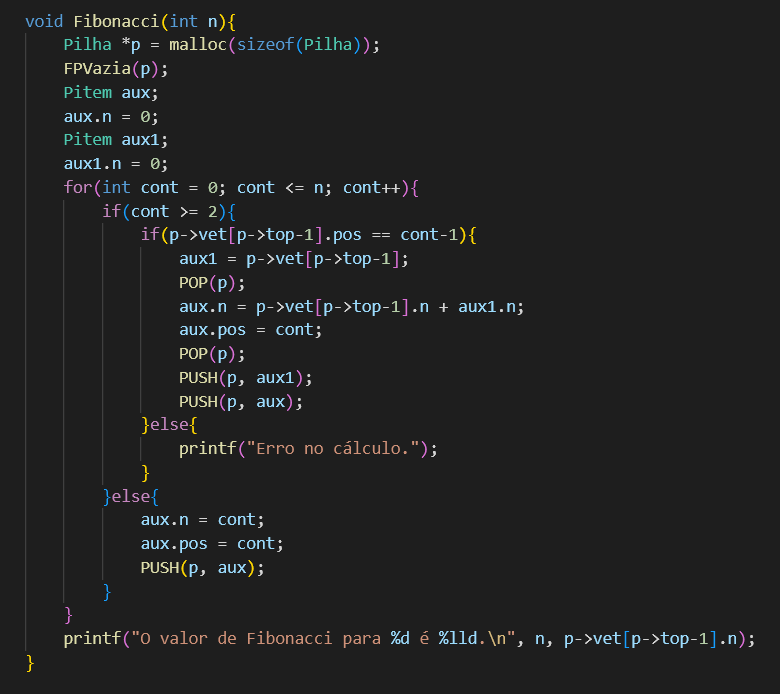

# Problema 2: Pilhas

 
 

 

  Os exercícios do problemas foram feitos com pilhas dinâmicas, [vide git](<a href="https://github.com/mpiress/dynamic_stack">(https://github.com/mpiress/dynamic_stack)</a>),  para facilitar a utilização do usuário foi-se criado um menu onde o mesmo pode escolher qual dos exercícios do Problema 2 ele quer ver o resultado. A figura abaixo mostra o menu criado:
  

    
  

# Problema 2-A 

  Para esse exercicio foi pedido para que o usuario informe uma equação matematica e crie uma função para que separe os numeros dos operadores, essa função devera separa-los em duas Pilhas.

  Depois de pedir para que o usuario informe uma operação o programa irá por meio de comparações separar essa equação em duas Pilhas sendo a Pilha 1 com os números da equação e a Pilha 2 coms os Operadores
  

    
  

  Ja na função de Imprimir ela irá imprimir os resultados da separação das duas Pilhas
  

    
    
  

# Problema 2-B

# Problema 2-C

  Nesse exercicio foi pedido para que, dada uma pilha de 20 posições preenchidas por números inteiros aleatórios entre 1 e 99, fosse utilizada em cada valor a função totiente de Euler para encontrar para esses números os co-primos.

  Depois de criada uma pilha vazia com 20 posições, através da função PreencheP a pilha foi preenchida por números aleatórios de 0 a 99:
  

    
  

  Em seguida foi chamada a função Coprimos, na qual, para cada posição da pilha, foi chamada a função totiente n-2 vezes. Foram passados comos parâmetros para a função o valor na posição da pilha (p->vet[p->top].n) e o valor do contador do loop que faz a chamada, que vai de 1 até um número menor que o valor na posição, por isso n-2. A função totiente é uma função recursiva, chamando a si mesma até que os valores de a e b sejam iguais:
  

    
  

  A função então retorna o valor dessas variáveis, e caso o valor retornado seja igual a 1, significa que o segundo valor passado como parâmetro é um número coprimo do primeiro, ou seja, que o valor de cont2 é coprimo do valor na posição, e por isso ele é impresso.
  Dessa forma, ao final da execução, temos a lista de todos os números coprimos para cada um dos 20 valores que estão na pilha:
  

    
  

# Problema 2-D

  Nesse exercicio foi pedido para que fosse criada uma função de realiza o cáculo de Fibonacci para um número n dado. Entretanto, para que fosse feito esse cálculo, era pra ser utilizado o conceito de pilhas e que fosse implementada uma forma de identificação dos valores nessa pilha, evitando erros em cálculos longos.

  Para isso, foi criada a função Fibonacci, que recebe um valor n como parâmetro (que é informado pelo usuário no começo da execução). Após a criação de uma pilha vazia p e de 2 itens auxiliares, é feito um loop que repete n+1 vezes (contando com o 0), no qual é criada uma condição:
  

    
  

  Caso o valor do contador seja 0 ou 1, o valor do próprio contador será empilhado, ou seja, para qualquer valor de n, os 2 primeiros valores sempre serão 0 e 1. A partir de  cont 2, no entanto, é feita uma verificação, para confirmar que o último valor empilhado é referente ao número anterior ao atual (n-1) e caso positivo, é feito uma soma, com a ajuda dos itens auxiliares criados anteriormente, dos 2 valores anteriormente empilhados (n-1 e n-2). Então, o valor de n-1 é novamente empilhado e o novo valor obtido é empilhado acima deste, criando um ciclo até que cont seja igual a n, quando o resultado da soma será o resultado de Fibonacci que será por fim impresso:
  

    
  

Sim, pois em funções recursivas, como poderia ser feito para calcular o Fibonacci nesse exercício por exemplo, o cálculo precisa ser interrompido diversas vezes até que se encontre o resultado do menor, quando enfim os cálculos são retomados para os números maiores até que no fim se chegue ao valor, o que para valores de n muito grandes não é muito eficiente. O cálculo com pilhas oferece uma alternativa a essas recursões, pois como foi demonstrado acima, é possível trabalhar diretamente com os menores valores no começo da execução da função, o que economiza bastante computações. Portanto, em situações que trabalham com números grandes de recursões e que se faz necessário trabalhar com uma determinada ordem de valores até chegar no resultado (de 0 a n como no caso de Fibonacci), o uso de pilhas se faz muito eficiente.

# Compilação e Execução

O progama disponibilizado possui um arquivo Makefile que realiza todo o procedimento de compilação e execução. Para tanto, temos as seguintes diretrizes de execução:

| Comando                |  Função                                                                                           |                     
| -----------------------| ------------------------------------------------------------------------------------------------- |
|  `make clean`          | Apaga a última compilação realizada contida na pasta build                                        |
|  `make`                | Executa a compilação do programa utilizando o gcc, e o resultado vai para a pasta build           |
|  `make run`            | Executa o programa da pasta build após a realização da compilação                                 |

Trabalho realizado por Gabriel Teixeira, Lívia Gonçalves, Marcus Vinícius e Augusto Bebiano - Junho/2022
